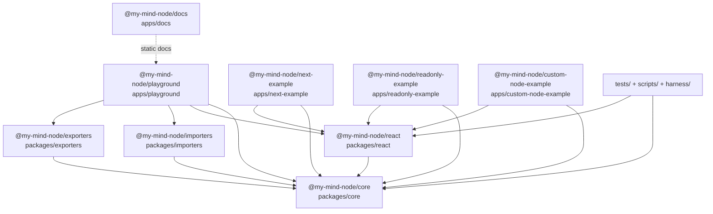
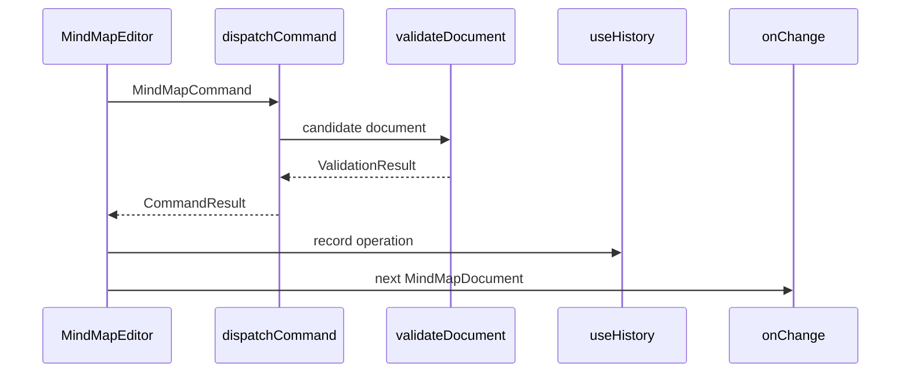
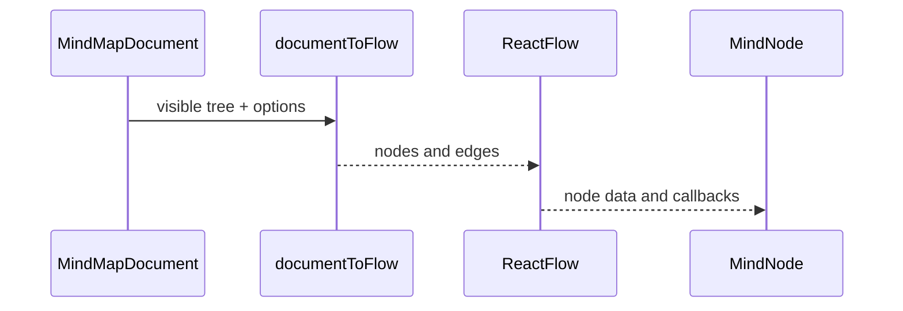

# Architecture

> Last regenerated: 2026-06-26  
> Source analysis: `package.json`, `pnpm-workspace.yaml`, `tsconfig.base.json`, `packages/*/src`, `apps/*/package.json`, `playwright.config.ts`.

## 1 Overview

`my-mind-node` is a pnpm workspace that ships a framework-independent mind map data core, a React Flow editor/viewer, optional import/export adapters, example apps, a VitePress docs site, and agent harness infrastructure. The workspace intentionally keeps `packages/core` free of React and adapter dependencies, then lets UI and apps consume the public package APIs.

> Sources: `README.md:1`, `README.md:8`, `README.md:18`, `package.json:2`, `pnpm-workspace.yaml:1`

## 2 System Architecture

### 2.1 Package Dependency Graph

> Sources: `packages/react/package.json:22`, `packages/importers/package.json:21`, `packages/exporters/package.json:21`, `apps/playground/package.json:12`, `apps/next-example/package.json:11`, `apps/readonly-example/package.json:11`, `apps/custom-node-example/package.json:11`, `tsconfig.base.json:17`

### 2.2 Layer Hierarchy

| Layer | Packages | Can Import | Cannot Import |
| --- | --- | --- | --- |
| L0 | `packages/core/` | standard JS runtime only | React, React Flow, apps, adapters |
| L1 | `packages/importers/`, `packages/exporters/` | `@my-mind-node/core` | `@my-mind-node/react`, apps, each other by default |
| L2 | `packages/react/` | `@my-mind-node/core`, React, React Flow, lucide | `@my-mind-node/importers`, `@my-mind-node/exporters`, apps |
| L3 | `apps/*` | public workspace packages | package-private source internals |
| L4 | `tests/`, `scripts/`, `harness/` | package public APIs and local tooling | production-only shortcuts or secrets |

> Enforced by: `scripts/lint-deps.mjs`  
> Sources: `packages/core/package.json:21`, `packages/react/package.json:22`, `apps/playground/package.json:12`, `tsconfig.base.json:17`

### 2.3 Forbidden Dependencies

- `packages/core` must not import React, React Flow, Vite, VitePress, Next.js, lucide, importers, exporters, or apps.
- `packages/react` must not import `@my-mind-node/importers` or `@my-mind-node/exporters`; optional format features stay in callers such as `apps/playground`.
- `packages/importers` and `packages/exporters` depend on `core` only, so they remain optional adapter packages.
- Every `packages/*` and `apps/*` package must be represented in `scripts/lint-deps.mjs`.

> Enforced by: `scripts/lint-deps.mjs`  
> Sources: `packages/core/src/index.ts:1`, `packages/react/src/index.ts:1`, `apps/playground/src/App.tsx:11`, `apps/playground/src/App.tsx:12`

## 3 Core Components

### 3.1 DOM-Free Core

`packages/core` defines branded IDs, the document schema, validation, commands, history, serialization, indented text, search, and layout helpers. `dispatchCommand` mutates documents through command objects, validates the result, and returns structured success/error unions instead of throwing for normal validation failures.

> Sources: `packages/core/src/types.ts:1`, `packages/core/src/types.ts:135`, `packages/core/src/commands.ts:35`, `packages/core/src/commands.ts:239`, `packages/core/src/validation.ts:211`, `packages/core/src/index.ts:1`

### 3.2 React UI Adapter

`packages/react` turns `MindMapDocument` into React Flow nodes/edges, wraps editing commands, owns toolbar/search/inspector/branch-list UI, and exposes `MindMapEditor`, `MindMapViewer`, and `OutlineEditor` from a package-local barrel. Browser failures are reported through `onError` as `MindMapError` objects.

> Sources: `packages/react/src/types.ts:93`, `packages/react/src/MindMapEditor.tsx:68`, `packages/react/src/MindMapEditor.tsx:220`, `packages/react/src/document-to-flow.ts:257`, `packages/react/src/MindMapViewer.tsx:4`, `packages/react/src/OutlineEditor.tsx:94`, `packages/react/src/index.ts:1`

### 3.3 Optional Format Adapters

`packages/importers` accepts JSON, Markdown, Mermaid mindmap, OPML, and indented text inputs, then returns `ParseResult<MindMapDocument>`. `packages/exporters` emits JSON, Markdown, Mermaid, OPML, indented text, SVG, and browser PNG results through `ExportResult`.

> Sources: `packages/importers/src/index.ts:12`, `packages/importers/src/index.ts:358`, `packages/importers/src/index.ts:378`, `packages/exporters/src/index.ts:4`, `packages/exporters/src/index.ts:148`

### 3.4 Apps And Examples

`apps/playground` is the integration target for import/edit/export and Playwright E2E. `apps/docs` builds the VitePress documentation site. The readonly, custom-node, and Next examples demonstrate narrower consumption of `core` and `react`.

> Sources: `apps/playground/src/App.tsx:88`, `apps/playground/src/App.tsx:161`, `apps/playground/src/App.tsx:251`, `apps/playground/vite.config.ts:17`, `apps/docs/package.json:6`, `apps/next-example/package.json:6`, `apps/readonly-example/package.json:6`, `apps/custom-node-example/package.json:6`

## 4 Data Flow

### 4.1 Document Mutation Flow

> Sources: `packages/react/src/MindMapEditor.tsx:220`, `packages/core/src/commands.ts:239`, `packages/core/src/validation.ts:211`, `packages/react/src/hooks/useHistory.ts:27`

### 4.2 Render Flow

> Sources: `packages/react/src/document-to-flow.ts:257`, `packages/react/src/MindMapEditor.tsx:329`, `packages/react/src/MindMapEditor.tsx:490`, `packages/react/src/nodes/MindNode.tsx:92`

### 4.3 Import And Export Flow

The playground debounces editor text, tries the active import format, falls back to detected Markdown or Mermaid when useful, validates imported documents, applies branch presentation, and syncs exported text when the selected tab changes.

> Sources: `apps/playground/src/App.tsx:120`, `apps/playground/src/App.tsx:161`, `apps/playground/src/App.tsx:168`, `apps/playground/src/App.tsx:187`, `packages/importers/src/index.ts:358`, `packages/exporters/src/index.ts:148`

### 4.4 Layout Flow

Core layout estimates node sizes, builds tree positions, applies layout results to cloned documents, and exposes a worker request/response contract. React can schedule layout with a worker and falls back to synchronous `simpleTreeLayout` when no worker is provided.

> Sources: `packages/core/src/layout.ts:47`, `packages/core/src/layout.ts:160`, `packages/core/src/layout.ts:236`, `packages/core/src/layout.ts:248`, `packages/react/src/layout-scheduler.ts:21`, `packages/react/src/layout.worker.ts:4`

## 5 Error Handling

The dominant error pattern is a discriminated result union containing `MindMapError`. Core validation creates recoverable errors with codes and paths. JSON parse failures become `INVALID_JSON`. Import/export adapters wrap unsupported or unsafe formats in structured errors, and React forwards browser or UI failures through `onError`.

> Sources: `packages/core/src/types.ts:109`, `packages/core/src/types.ts:117`, `packages/core/src/validation.ts:15`, `packages/core/src/validation.ts:302`, `packages/importers/src/index.ts:21`, `packages/importers/src/index.ts:324`, `packages/exporters/src/index.ts:17`, `packages/react/src/MindMapEditor.tsx:150`

## 6 Build And Verification Topology

Root scripts compose package builds/tests and app builds. Playwright starts the playground with `pnpm --filter @my-mind-node/playground dev` and expects `http://127.0.0.1:5187`. GitHub Pages is a deployment workflow, while `.github/workflows/ci.yml` is the quality gate for PRs and `main`.

> Sources: `package.json:8`, `package.json:10`, `package.json:12`, `package.json:18`, `playwright.config.ts:5`, `playwright.config.ts:7`, `.github/workflows/pages.yml:29`, `.github/workflows/ci.yml:21`

## 7 See Also

- `docs/DEVELOPMENT.md`
- `docs/QUALITY.md`
- `docs/design-docs/core.md`
- `docs/design-docs/react.md`
- `docs/design-docs/import-export.md`
- `docs/design-docs/playground-and-examples.md`
