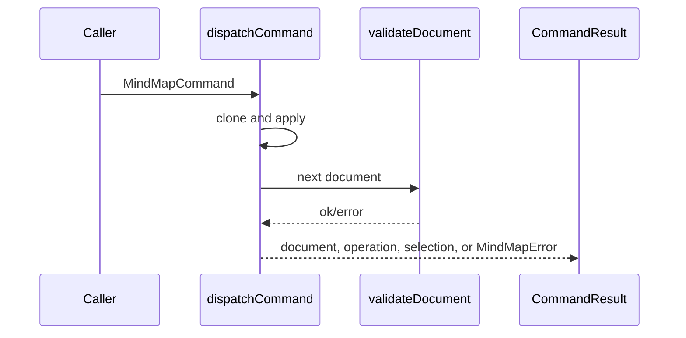

# Core Package

> Last updated: 2026-06-26  
> Primary source: `packages/core/src/index.ts`

## 1 Overview

`@my-mind-node/core` owns the framework-independent document contract for mind maps: branded IDs, document/node/connection/tag/theme types, validation, command dispatch, history, serialization, indented text, search, and layout.

> Sources: `packages/core/src/types.ts:1`, `packages/core/src/types.ts:16`, `packages/core/src/types.ts:135`, `packages/core/src/index.ts:1`

## 2 Public Surface

| Area | Main exports | Source |
| --- | --- | --- |
| Schema | `MindMapDocument`, `MindMapNode`, `MindMapConnection`, `MindMapTheme` | `packages/core/src/types.ts:16` |
| Creation | `createEmptyDocument`, `createNode`, `cloneDocument` | `packages/core/src/document.ts:27` |
| Validation | `validateDocument`, `parseDocument` | `packages/core/src/validation.ts:211` |
| Commands | `dispatchCommand`, `applyOperation`, `MindMapCommand` | `packages/core/src/commands.ts:239` |
| History | `HistoryManager` | `packages/core/src/history.ts:9` |
| Layout | `simpleTreeLayout`, `applyLayoutResult` | `packages/core/src/layout.ts:236` |
| Search | `searchDocument` | `packages/core/src/search.ts:11` |

> Sources: `packages/core/src/index.ts:1`

## 3 Command Flow

> Sources: `packages/core/src/commands.ts:35`, `packages/core/src/commands.ts:61`, `packages/core/src/commands.ts:239`, `packages/core/src/validation.ts:211`

## 4 Validation Rules

Validation normalizes unknown input into the document schema, checks root existence, parent/child back references, tag references, positive node scale, valid connection endpoints, tree cycles, and unreachable nodes.

> Sources: `packages/core/src/validation.ts:33`, `packages/core/src/validation.ts:138`, `packages/core/src/validation.ts:176`, `packages/core/src/validation.ts:211`, `packages/core/src/validation.ts:293`

## 5 Layout

Layout estimates text width, node width/height, builds a tree layout, supports directional layouts, computes bounding boxes, applies positions to cloned documents, and defines worker request/response types for UI scheduling.

> Sources: `packages/core/src/layout.ts:47`, `packages/core/src/layout.ts:56`, `packages/core/src/layout.ts:65`, `packages/core/src/layout.ts:137`, `packages/core/src/layout.ts:210`, `packages/core/src/layout.ts:236`, `packages/core/src/layout.ts:312`

## 6 Testing

Core unit tests cover document creation, commands, validation, indented text, layout, history, search, selection, and serialization through the package Vitest suite.

> Sources: `packages/core/package.json:17`, `packages/core/src/__tests__/core.test.ts:18`
