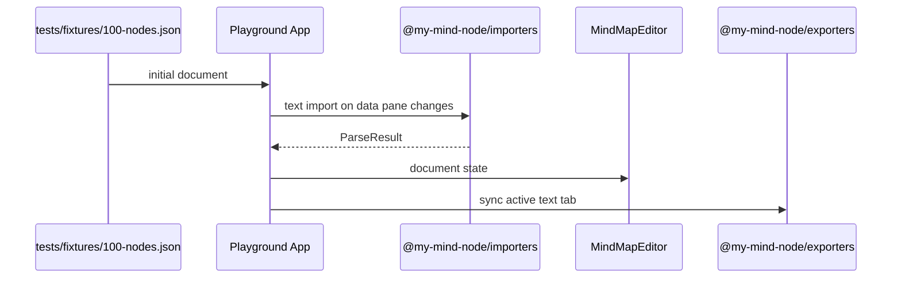

# Playground And Examples

> Last updated: 2026-06-26  
> Primary source: `apps/playground/src/App.tsx`

## 1 Overview

The apps workspace contains the Vite playground, VitePress docs, Next SSR-safe example, readonly viewer example, and custom node renderer example. The playground is the main browser integration target and the app Playwright starts for E2E.

> Sources: `pnpm-workspace.yaml:1`, `apps/playground/package.json:2`, `apps/docs/package.json:2`, `apps/next-example/package.json:2`, `apps/readonly-example/package.json:2`, `apps/custom-node-example/package.json:2`, `playwright.config.ts:5`

## 2 Playground Flow

> Sources: `apps/playground/src/App.tsx:15`, `apps/playground/src/App.tsx:88`, `apps/playground/src/App.tsx:120`, `apps/playground/src/App.tsx:161`, `apps/playground/src/App.tsx:251`

## 3 Vite Playground Runtime

The playground uses source aliases for local packages and pins the dev server to port `5187` with `strictPort: true`. Playwright uses that same URL as its base URL.

> Sources: `apps/playground/vite.config.ts:5`, `apps/playground/vite.config.ts:9`, `apps/playground/vite.config.ts:17`, `playwright.config.ts:5`, `playwright.config.ts:11`

## 4 Documentation App

The docs app runs VitePress from `apps/docs/docs`, and GitHub Pages builds docs plus playground static output into a combined Pages artifact.

> Sources: `apps/docs/package.json:7`, `apps/docs/package.json:8`, `.github/workflows/pages.yml:29`, `.github/workflows/pages.yml:31`, `.github/workflows/pages.yml:34`, `.github/workflows/pages.yml:36`

## 5 Example Apps

`apps/next-example` demonstrates SSR/static export usage with `transpilePackages`. `apps/readonly-example` demonstrates `MindMapViewer`. `apps/custom-node-example` demonstrates custom node rendering with `MindMapEditor`.

> Sources: `apps/next-example/package.json:7`, `apps/next-example/next.config.mjs:2`, `apps/next-example/app/page.tsx:3`, `apps/readonly-example/src/App.tsx:1`, `apps/readonly-example/src/App.tsx:2`, `apps/custom-node-example/src/App.tsx:1`, `apps/custom-node-example/src/App.tsx:2`

## 6 E2E

Playwright runs against `tests/e2e`, starts the playground with the package dev command, reuses an existing server when present, and covers Chromium, Firefox, WebKit, and mobile WebKit projects.

> Sources: `playwright.config.ts:3`, `playwright.config.ts:5`, `playwright.config.ts:8`, `playwright.config.ts:14`, `tests/e2e/playground.spec.ts:1`
