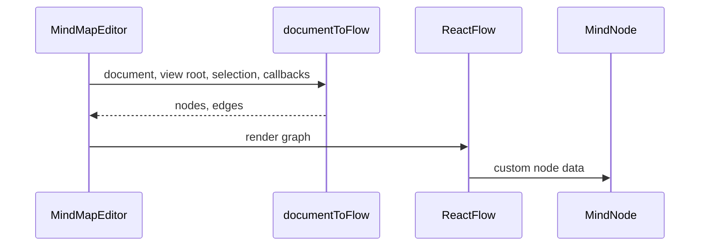

# React Package

> Last updated: 2026-06-26  
> Primary source: `packages/react/src/MindMapEditor.tsx`

## 1 Overview

`@my-mind-node/react` adapts `MindMapDocument` into an interactive React Flow editor and readonly viewer. It owns UI state, toolbar actions, panels, themes, branch list mode, drag interactions, viewport control, and React component contracts.

> Sources: `packages/react/src/types.ts:93`, `packages/react/src/MindMapEditor.tsx:68`, `packages/react/src/MindMapViewer.tsx:4`, `packages/react/src/OutlineEditor.tsx:94`

## 2 Component Surface

| Component or type | Purpose | Source |
| --- | --- | --- |
| `MindMapEditorProps` | Main controlled/uncontrolled editor contract | `packages/react/src/types.ts:93` |
| `MindMapEditor` | React Flow provider and editor canvas | `packages/react/src/MindMapEditor.tsx:618` |
| `MindMapViewer` | Readonly editor wrapper with viewer toolbar defaults | `packages/react/src/MindMapViewer.tsx:4` |
| `OutlineEditor` | Tree outline editor backed by core commands | `packages/react/src/OutlineEditor.tsx:94` |
| `documentToFlow` | Converts documents to React Flow nodes/edges | `packages/react/src/document-to-flow.ts:257` |
| `createLayoutScheduler` | Debounced layout worker/fallback wrapper | `packages/react/src/layout-scheduler.ts:21` |

> Sources: `packages/react/src/index.ts:1`

## 3 Render Flow

> Sources: `packages/react/src/MindMapEditor.tsx:329`, `packages/react/src/MindMapEditor.tsx:490`, `packages/react/src/document-to-flow.ts:305`, `packages/react/src/nodes/MindNode.tsx:92`

## 4 Editing And History

Editor commands call `dispatchCommand`, auto-layout when requested, push operations into history, synchronize selection, and call `onChange`. Undo, redo, and reset are exposed through toolbar controls and keyboard shortcuts.

> Sources: `packages/react/src/MindMapEditor.tsx:220`, `packages/react/src/MindMapEditor.tsx:227`, `packages/react/src/MindMapEditor.tsx:410`, `packages/react/src/MindMapEditor.tsx:445`, `packages/react/src/hooks/useHistory.ts:27`

## 5 Drag And Viewport Interaction

Drag behavior is factored into geometry, intent validation, and the `useDragInteraction` hook. Viewport behavior is managed by `useViewportControl`, which schedules fit, center, and resize-safe updates around React Flow.

> Sources: `packages/react/src/drag-geometry.ts:4`, `packages/react/src/drag-interactions.ts:109`, `packages/react/src/drag-interactions.ts:186`, `packages/react/src/hooks/useDragInteraction.ts:65`, `packages/react/src/hooks/useViewportControl.ts:52`

## 6 Safety Boundaries

The React package validates external links before opening them and reports fullscreen, export, link, layout worker, and other browser failures through structured `MindMapError` callbacks. It does not import optional import/export adapters.

> Sources: `packages/react/src/link-utils.ts:20`, `packages/react/src/MindMapEditor.tsx:199`, `packages/react/src/MindMapEditor.tsx:438`, `packages/react/src/layout-scheduler.ts:40`, `scripts/lint-deps.mjs:79`

## 7 Testing

The React Vitest suite covers smoke rendering, editor regressions, link safety, drag geometry, viewport utilities, layout helpers, and toolbar/history utilities.

> Sources: `packages/react/package.json:18`, `packages/react/src/__tests__/react-smoke.test.tsx:85`, `packages/react/src/__tests__/editor-regressions.test.tsx:1`, `packages/react/src/__tests__/link-utils.test.ts:1`
